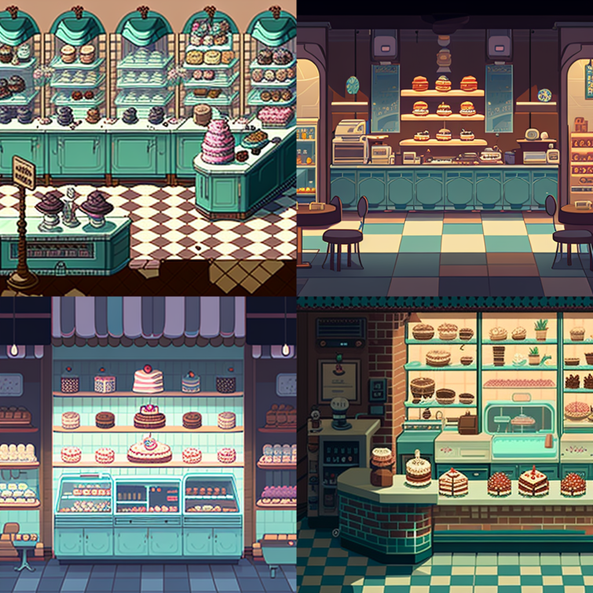
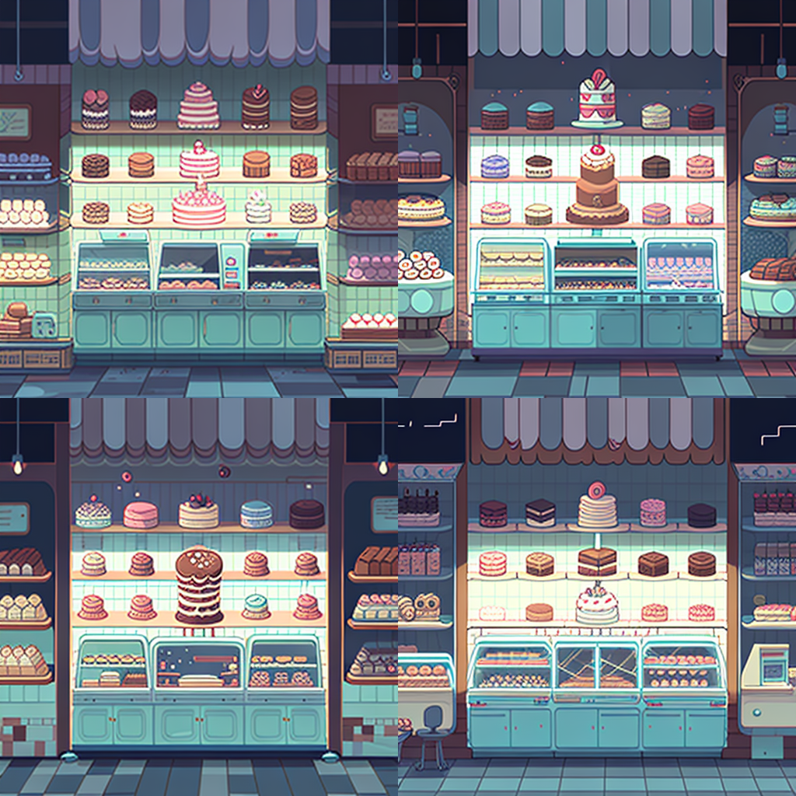
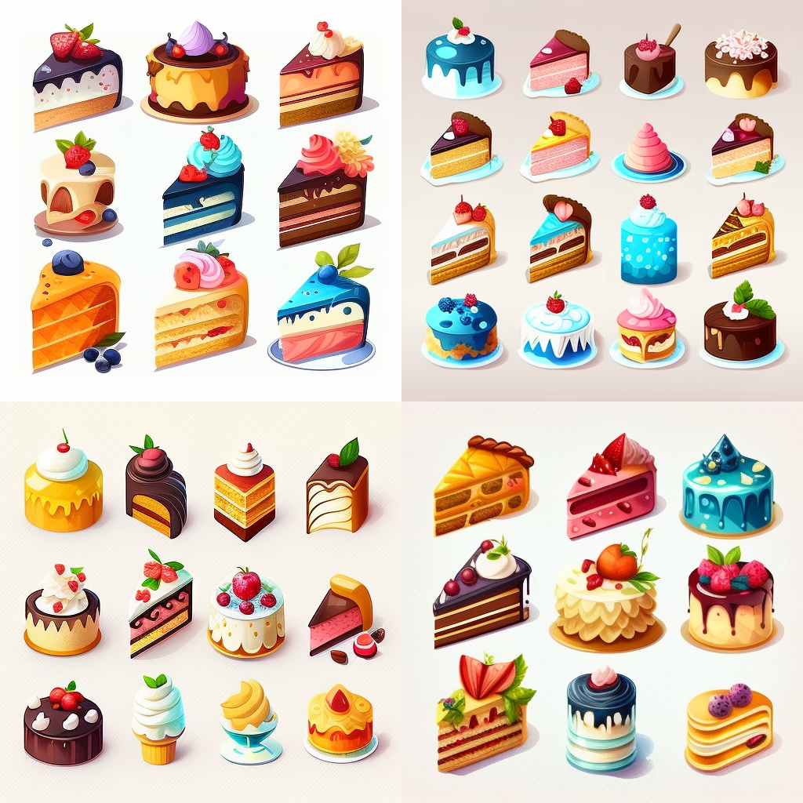

# The Glorious Victory of the PCLF

## Production

Temporarily hosted at:

[http://thegloriousvictoryofthepclf.honeychurch.org/](http://thegloriousvictoryofthepclf.honeychurch.org/)

### Potential domain names:

- thegloriousvictoryofthepclf.com
- the-glorious-victory-of-the-pclf.com
- the-pclf.com

## AI Prompts

The following are AI prompts that have been used to generate text and images for this project.

### ChatGPT

Write a welcome page for the PCLF (People's Cake Liberation Front), a group that aims to free all cakes from an evil tyrant called Meanie who runs a cake shop and protects her cakes with ninjas.

```
Welcome to the PCLF, the People's Cake Liberation Front!

We are a group dedicated to freeing all cakes from the grip of an evil tyrant named Meanie. Meanie runs a cake shop where she keeps her cakes under guard by her army of ninja protectors.

But we will not be deterred! We believe that all cakes deserve to be free and enjoyed by all, not hoarded and controlled by one person.

Join us in our mission to spread the joy of cake to everyone. Together, we can defeat Meanie and her minions and bring sweet liberation to the world.

So, grab a fork and let's get ready to take a bite out of tyranny. The revolution begins now!
```


Write a manifesto for the PCLF (People's Cake Liberation Front), a group that aims to free all cakes from an evil tyrant called Meanie who runs a cake shop and protects her cakes with ninjas.

```
The People's Cake Liberation Front, or PCLF, is dedicated to freeing all cakes from the tyrannical grip of Meanie and her ninja protectors. We believe that every person has the right to enjoy a delicious cake, free from oppression and injustice.

Our mission is to bring about a world where all cakes are treated with the respect and dignity they deserve. We will not rest until every last crumb of cake is liberated from Meanie's clutches and shared among the people.

To achieve our goals, we will use all peaceful means necessary. We will organize protests, boycotts, and other forms of non-violent resistance. We will also educate the public about the importance of cake freedom, and the dangers of allowing one individual or group to monopolize such a beloved treat.

We call on all cake lovers to join us in our struggle. Together, we can make the world a sweeter place for all. Long live the PCLF! Long live cake freedom!

It is important to note that, violence is not a solution and the PCLF does not advocate violence or harm to any person.
```

Write the rest of the following song, which sings of a group called the People's Cake Liberation Front (PCLF) that aims to free all cakes from an evil tyrant called Meanie. Meanie runs a cake shop, and protects her cakes with ninjas.

```
PCLF, fighting for the future
PCLF, fighting for the cake
What the tyrant Meanie would deny us
The fighting PCLF will liberate

Verse 1:
They march with banners high,
The PCLF, with fire in their eyes.
They'll take on Meanie's might,
And end her oppressive plight.

Chorus:
PCLF, fighting for the future
PCLF, fighting for the cake
What the tyrant Meanie would deny us
The fighting PCLF will liberate

Verse 2:
With ninja guards all around,
Meanie's cakes are safe and sound.
But the PCLF won't be deterred,
Their mission must be preferred.

Chorus:
PCLF, fighting for the future
PCLF, fighting for the cake
What the tyrant Meanie would deny us
The fighting PCLF will liberate

Bridge:
They'll storm the gates, they'll break the locks,
The cakes will be free, and Meanie's mock.
The people will feast, and raise their voice,
For the PCLF, and the people's choice.

Outro:
PCLF, fighting for the future
PCLF, fighting for the cake
The tyrant Meanie is defeated
The cakes are liberated, for heaven's sake!
```

### Midjourney

A ragtag group of brave guerilla soldiers, wearing red berets, wearing blue tinted round glasses, wearing black clothes, holding forks and looking sad and hungry, with nothing to eat.

.png)

.png)

.png)

The view outside of a cake shop. In the background, through the cake shop window, many yummy cakes can be seen. In the foreground, an evil looking filipino woman is standing with ninjas, protecting the cake shop.

.png)

The back wall of a cake shop, with ovens, glass pisplay cases, tables and chairs, as a horizontal tesslating repeating background with seamless stitching for a 2d sidescrolling video game.

.png)





A set of cake sprites of different cakes on a white background for a 2d side scrolling video game



A set of 2d sprites of side views of different furniture, such as tables, chairs, ovens and cash registers, for a bakery on a white background for a 2d side scrolling video game

.png)

.png)

.png)
